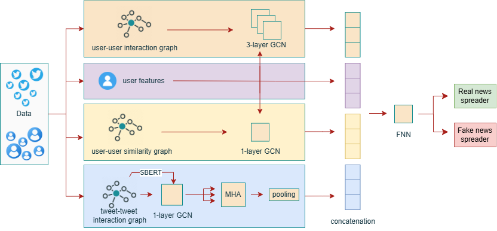
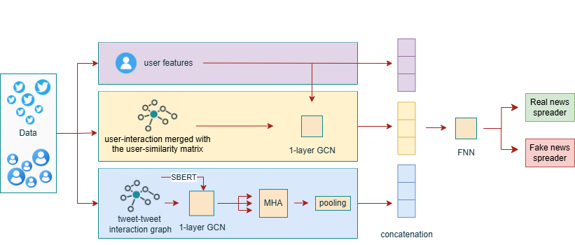

# Identifying Misinformation Spreaders: Challenges and Model Architectures

This repository contains the implementation of the paper  
**"Identifying Misinformation Spreaders: A Multi-Source Hybrid Model" (UMAP 2026)**.

## TL;DR



A hybrid Graph + NLP model for detecting misinformation spreaders.

- Combines BERT embeddings with Graph Convolutional Networks (GCNs)
- Models user similarity, interactions, and content in parallel
- Achieves state-of-the-art MCC and F1-score on the FibVid dataset
- Designed to generalize to unseen users via temporal split
- This can help platforms detect misinformation spreaders automatically

## Quick start

1. **Create and activate environment**

```
conda env create -f environment.yaml
conda activate mshmodel
```

2. **Download required BERT embeddings**

Download [BERT embeddings](https://drive.google.com/file/d/10b5Ab2H5qjWLKJGx86bBwHgCie0FMPxp/view?usp=sharing) and place the file under the name `df_tweets_embeddings_bert.pickle` into: `data/`

3. **Run pretrained model**

```
python write_predictions.py --model_name final_binary --save
```

## Motivation

The ease of sharing information on online platforms has led to a significant increase in the creation and propagation of misinformation. The propagation of false or misleading news not only contributes to psychological distress and emotional overload but also has far-reaching negative consequences on individuals and society as a whole. 

Challenges that traditional approaches struggle with:

 - Misinformation is often intentionally written to deceive users into believing it.
 - Some false or misleading content might be partially correct or reference legitimate facts or information. 
 - Immediately verifying misinformation can be difficult, as they might be referring to recent events for which credible sources may not yet be available. 
 - The credibility of certain information may remain unverifiable.

In this report, we discuss the challenges associated with detecting misinformation spreaders and propose two models with different feature sets and architectures, including a lightweight variant, not included in the UMAP. The models combine content-based features with graph-based representations for more fine-grained analysis. Evaluated against traditional attribute-based and state-of-the-art baselines on a benchmark dataset with a single temporal split, the primary model achieves the best Matthews correlation coefficient and F1-score. In contrast, the lightweight variant achieves the second-best Matthews score.

## Architecture proposed

An overview of the model architecture is shown in the TL;DR section above. We incorporate multiple information sources, including three graph-based components: *User-with-User Similarity Graph (UUSG)*, *Publication-with-Publication Interaction Graph (PPIG)*, and *User-with-User Interaction Graph (UUIG)*, as well as a user feature set. To model social interactions, we employ Graph Convolutional Networks (GCNs), a commonly used and powerful graph embedding technique.

The resulting vectors from each matrix processed via the GCN are concatenated with one another and with the full set of user-specific features. The resulting vector is then passed through a Feedforward Neural Network (FNN) for final classification. A more detailed description can be found in the paper.

The ablation study reveals that the removal of graph-based components leads to a slight increase in precision, accompanied by a notable decrease in recall and overall performance metrics. This indicates that relational information plays a key role in capturing misinformation spreading behavior.

### Acronyms

| Acronym | Description |
|--------|------------|
| UUSG | User-with-User Similarity Graph |
| PPIG | Publication-with-Publication Interaction Graph |
| UUIG | User-with-User Interaction Graph |
| SIUM | Similarity-Interaction-United Model |
| TTIG | Tweet-Text Interaction Graph |
| MCC | Matthews Correlation Coefficient |

## Evaluation

For evaluation, Precision, Recall, F1-score, and the Matthews Correlation Coefficient (MCC) are used. MCC is particularly informative in the presence of class imbalance, which is the case in this setting. These metrics are commonly adopted and well suited to binary classification tasks. 

The model prioritizes recall over precision, as the primary objective is to minimize the risk of failing to detect such cases. 

For the three-class classification setting, the same evaluation metrics are applied. Precision, Recall, and F1-score are computed using macro averaging to account for class imbalance.

## Ablation Results

The ablation study was conducted in a sequential manner due to computational constraints and is provided in the `ablation_results/` directory.

Starting from a fixed baseline configuration, individual components were removed or modified one at a time, while keeping all other parameters constant.

The ablation study reveals that removing any major component of the model results in a decrease in F1-score, recall, and MCC, underscoring the importance of each part of the pipeline. Among the components, the User-with-User Similarity Graph contributes most strongly to overall performance.

## Dataset

In this work, we primarily rely on the [**FibVid**](https://doi.org/10.5281/zenodo.4441377). This dataset comprises news claims extracted from several fact-checking journalism platforms, including [*PolitiFact*](https://www.politifact.com/) and [*Snopes*](https://www.snopes.com/). It covers both COVID-19–related and contemporaneous non-COVID topics from January 2020 to December 2020. 

| Dataset | #Tweets | Language | Tree of Responses | Additional User Info | Labels       |
|---------|---------|----------|-------------------|----------------------|--------------|
| FibVid  | 161,838 | English  | Yes               | Yes                  | per tweet    |

The dataset comprises 772 news claims, each associated with a total of 161,838 related tweets. Among these claims, 26\% are labeled as authentic and 74\% as fake. Tweets are labeled individually.

The folder `data` includes the hand-crafted features used as part of the model. No pre-processing is required upon downloading the data. To get BERT embeddings of the tweets, please download BERT embeddings from this link and parse them to the `data` folder.

The dataset encompasses a range of subtopics within this broader event, enabling analyses across different narratives and claims. However, because all data stem from the same overarching event, the dataset might not support cross-event generalization, which constitutes an inherent limitation.

The task focuses on predicting whether previously unseen users (i.e., users unknown at training time) are misinformation spreaders; therefore, the split is temporal.

Precomputed BERT embeddings are required for the TTIG component.

They can be downloaded from: [**Google Drive link**](https://drive.google.com/file/d/10b5Ab2H5qjWLKJGx86bBwHgCie0FMPxp/view?usp=sharing).

After downloading, place the file:
`df_tweets_embeddings_bert.pickle`
into the `data/` directory.

Alternatively, embeddings can be recomputed if required.

## Setup

As an initial setup, you need to set up an environment. To create the environment, paste the following lines in the command line opened to the code's base folder:

```
conda env create -f environment.yaml
```

Then activate the environment, after it was created:

```
conda activate mshmodel
```

### File Structure

```
└── misinf_detection_model/
    ├── environment.yaml                     # Environment file
    ├── README.md                            # <= You are here
    ├── mshmodel_UMAP2026_LBR.pdf            # Research paper
    │
    ├── images/
    │   ├── readme/                          # images used in README
    │   │   ├── model_pipeline.png
    │   │   └── sium.png
    │   └── plots/                           # detailed feature analysis
    ├── ablation_results/                    # variations of the main model 
    │   ├── ablation_main_model_results.csv
    │   └── sium_variant_results.csv
    ├── grid_search/                         # dir to create variations in the paper
    │   ├── model_hyperparameters.json
    │   └── model_hyperparameters_configurations.json
    │
    ├── data/                                # all required data for the model
    │   ├── gg_users_full.gpickle
    │   ├── gg_tweets_full.gpickle
    │   ├── simMatrix_nx.gpickle
    │   ├── df_tweets_embeddings_bert.pickle
    │   └── users_profile_split_temporal.pickle
    │
    ├── models/                              # all model variants and configurations
    │   ├── final_binary/                    # pretrained binary model (epochs + config)
    │   │   ├── model-epoch_1.pt
    │   │   ├── ...
    │   │   ├── model-epoch_13.pt
    │   │   └── model_hyperparameters.json
    │   │
    │   ├── final_multiclass/                # pretrained multiclass model (epochs + config)
    │   │   ├── model-epoch_1.pt
    │   │   ├── ...
    │   │   ├── model-epoch_13.pt
    │   │   └── model_hyperparameters.json
    │   │
    │   ├── final_sium_binary/               # SIUM binary model variant
    │   │   ├── model-epoch_1.pt
    │   │   ├── ...
    │   │   ├── model-epoch_13.pt
    │   │   └── model_hyperparameters.json
    │   │
    │   ├── model_sium_binary/               # SIUM training configuration
    │   │   └── model_hyperparameters.json
    │   │
    │   ├── model_multiclass/                # multiclass training configuration
    │   │   └── model_hyperparameters.json
    │   │
    │   └── model_binary/                    # test training
    │       └── model_hyperparameters.json
    │
    ├── sitif_data.py                        # custom dataset (preprocessing and loading)
    ├── train_process.py                     # model training
    ├── write_predictions.py                 # model evaluation
    ├── hp_search_and_ablation.py            # hyperparameter search and ablation study
    ├── test_all_models.py                   # tests all trained models and creates evaluation CSV
    ├── dict_operation.py                    # utilities for handling dictionaries
    └── similarity_model.py                  # similarity matrix calculation
```

## Run

```
To view available options and arguments for each script, run them with "--help".
```

In this section, we provide a step-by-step instruction on how to run the required code and follow the described steps. All of the code was implemented in Python using sklearn and PyTorch. All required external libraries are listed in the `environment.yaml` file. All of the command prompts provided should be run from the command prompt positioned in the base code folder.

### Test the pretrained model:

To run a pretrained model that is attached to the repository, described in more detail in the paper, with all of the hyperparameters, run the following command in your environment in your CMD:

```
python write_predictions.py --model_name final_binary --save
```

This command evaluates the best-performing model described in the paper on the provided dataset. The model relies on precomputed BERT embeddings for the TTIG component. These embeddings are provided; alternatively, they can be recomputed if required. The saved table has the following structure, with values rounded and minimized for clarity:

The evaluation produces results of the following form:

| Epoch | Precision | Recall  | Matthews Corrcoef | F1     |
|-------|-----------|--------|-----------------|--------|
| 1     | 0.795     | 0.694  | 0.496           | 0.741  |
| 2     | 0.793     | 0.753  | 0.533           | 0.772  |
| …     | …         | …      | …               | …      |
| 12    | 0.812     | 0.759  | 0.563           | 0.785  |
| 13    | 0.794     | 0.855  | 0.613           | 0.823  |

The proposed model consistently outperforms both state-of-the-art approaches and simple feature-based baselines across the main evaluation metrics. In particular, it achieves the highest F1-score and Matthews Correlation Coefficient.

### Train a model:

To train a model from scratch, you will need to set all of the hyperparameters. They are attached here, in the folder `models/model_binary`. To train a model with the hyperparameters presented in the research, run the following in your command prompt:

```
python train_process.py --model_name model_binary --save_model_locally --keep_noted
```

If modification of hyperparameters is required, it is recommended to modify them manually in `models/model_binary/model_hyperparameters.json` and then execute the prompt above.

### Run a (partial) hyperparameter search:

To generate all model variations displayed in the paper, run the following prompt:

```
python hp_search_and_ablation.py --store_results --save_checkpoints --keep_noted
```

This process is computationally intensive and may require a substantial amount of time (~12 hours, depending on hardware). This will perform a grid search over a specific set of hyperparameters for the model, using the given variables to test. Unless `--improve` is passed, this will not attempt to optimize the hyperparameters; instead, it will run a different variation of the default fallback model, with an isolated single hyperparameter changed, while all other hyperparameters remain the same, as specified in the default fallback. A full grid hyperparameter search was not performed in those experiments due to computational power limitations.

### Test multiple models

To further automate the process, we implemented automatic tests of all models in the folder. After generating multiple model variations that require evaluation, please run the following prompt in the command prompt.

```
python test_all_models.py
```

This will create a separate evaluation CSV file in every folder with a model.

### Compute a similarity matrix:

To compute the user similarity matrix following the guidelines presented in the paper, run the following prompt:

```
python similarity_model.py
```

This process may require a substantial amount of time (~40 minutes, depending on hardware). 

### Multiclass setting

In addition to binary classification, a multiclass classification setting is considered to provide a more fine-grained characterization of user behavior. Given $m$ thresholds, this results in $m+1$ classes: $[0,k_1),...,(k_m,1]$. Users with a misinformation ratio below 0.35 are classified as non-spreaders, those above 0.65 as spreaders, and those in between as potential spreaders. The intermediate class captures users with less clearly defined behavior, which may benefit from further observation, particularly in evolving settings.

To test a pretrained multiclass model, execute the following command in your CMD:

```
python write_predictions.py --model_name final_multiclass --last_epoch 10 --save
```

The evaluation produces results of the following form:

| Epoch | Precision | Recall | Matthews Corrcoef | F1    |
|-------|----------|--------|-------------------|-------|
| 1     | 0.625    | 0.537  | 0.439             | 0.527 |
| 2     | 0.637    | 0.570  | 0.475             | 0.573 |
| …     | …        | …      | …                 | …     |
| 9     | 0.660    | 0.657  | 0.516             | 0.658 |
| 10    | 0.692    | 0.645  | 0.542             | 0.659 |

In the multi-class setting, the model achieves slightly higher overall performance compared to the binary classification scenario. An analysis of the class distributions shows that the intermediate class is predominantly composed of non-spreaders, which helps explain the observed performance differences.

To train a multiclass model, execute the following command in your CMD:

```
python train_process.py --model_name model_multiclass --save_model_locally --keep_noted
```

### User-with-User Similarity-Interaction-United Model (SIUM)

In addition to the primary model, a second model is proposed that integrates the user interaction matrix and the user similarity matrix into a single representation. The processing pipeline for this model is illustrated in the figure below. 

By operating on a unified User-with-User Similarity Graph and avoiding the use of parallel GCNs, SIUM reduces computational complexity, achieving an approximate 40\% improvement in reduction in overall computational cost and training.



To run a precomputed SIUM, described in more detail in the paper (with a threshold of 0.85 and $k$-top-sim set to 15), run the following command in your environment in your CMD:

```
python write_predictions.py --model_name final_sium_binary --sim_matrix data\\simMatrix_united_15_85.gpickle --last_epoch 10 --save
```

The evaluation produces results of the following form:

| Epoch | Precision | Recall | Matthews Corrcoef | F1    |
|-------|----------|--------|-------------------|-------|
| 1     | 0.778    | 0.670  | 0.459             | 0.720 |
| 2     | 0.803    | 0.676  | 0.494             | 0.734 |
| …     | …        | …      | …                 | …     |
| 9     | 0.817    | 0.695  | 0.523             | 0.751 |
| 10    | 0.782    | 0.834  | 0.580             | 0.807 |

To train the model described in the paper, you need to paste the following prompt to the CMD:

```
python train_process.py --model_name model_sium_binary --sim_matrix data\\simMatrix_united_15_85.gpickle --save_model_locally --keep_noted
```

To create a Similarity-Interaction-United-Graph, run the following command (Note: for that, you initially need to construct a Similarity model):

```
python sitif_data.py --data_name data_SIUM --path data --sim_matrix data\\simMatrix_top15_th85.gpickle
```

For each configuration of SIUM, only the GCN architecture is tuned based on validation performance, while the remaining hyperparameters are inherited from the full model.

## Project Information

### Contact

For questions, please open an issue or contact `r.chervinskyy@gmail.com`

### License

This project is licensed under the MIT License.

### Citation

Under review at ACM UMAP 2026. Citation will be updated upon publication.
